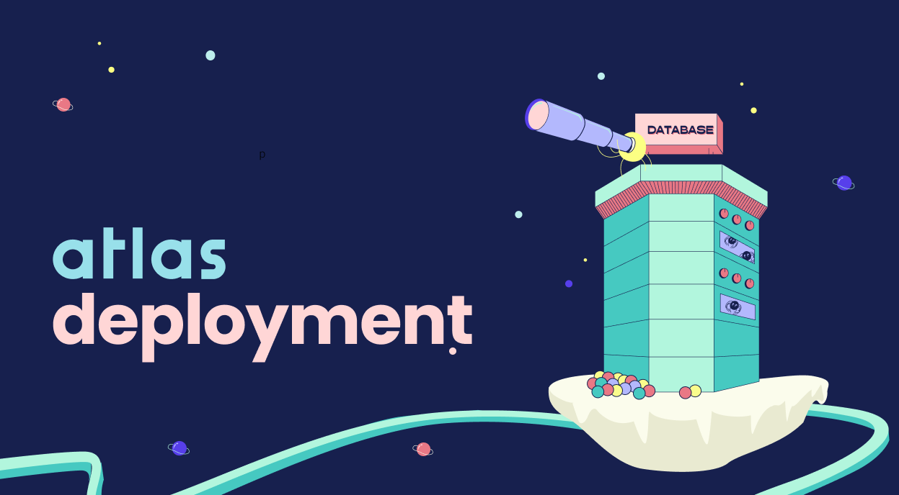

<!-- truncate -->
    

      <header style={{ backgroundColor: '#f0f0f0', padding: '20px', textAlign: 'center' }}>
        <h1 style={{ fontSize: '2.5em', margin: '10px 0' }}>A Brief History & Ethos of the Digital Garden</h1>
        
A newly revived philosophy for publishing personal knowledge on the web

        

          Digital Gardening
          Personal Knowledge
          The Web
        

        
Planted about 4 years ago &nbsp;|&nbsp; Last tended over 3 years ago

      </header>

      <main style={{ padding: '20px', maxWidth: '900px', margin: '0 auto', backgroundColor: '#fff' }}>
        <section className="introduction">
          
          
This is the introductory text that would go here, providing a brief summary or an inviting paragraph that introduces the ethos of the digital garden.

        </section>

        <section className="content">
          <h2 style={{ marginTop: '30px', fontSize: '2em', color: '#d23f57' }}>A Brief History of Digital Gardens</h2>
          
Content text begins here. This can be paragraphs discussing the history of digital gardens, early implementations, and more details as shown in the screenshot.

          <blockquote style={{ backgroundColor: '#f7f7f7', padding: '20px', fontSize: '1.2em', fontStyle: 'italic', borderLeft: '5px solid #d23f57', margin: '20px 0' }}>
            
A key quote or a notable insight from the article, styled to stand out from the rest of the text.

          </blockquote>

          

            
            
          

          <h2 style={{ marginTop: '30px', fontSize: '2em', color: '#d23f57' }}>Conclusion</h2>
          
The conclusion or ending summary of the article with final thoughts and insights.

        </section>
      </main>

      <footer style={{ textAlign: 'center', padding: '20px', backgroundColor: '#f0f0f0', marginTop: '30px' }}>
        
Published by [Author Name]

      </footer>
    

